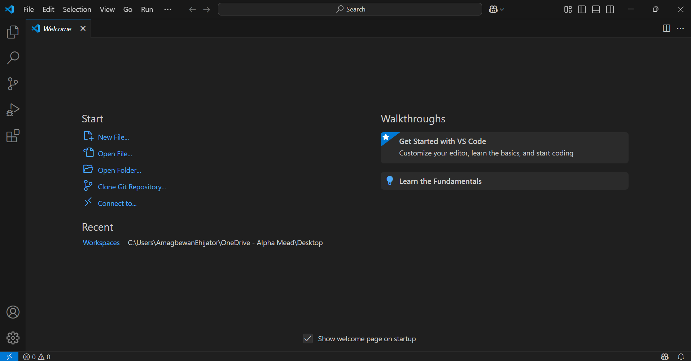
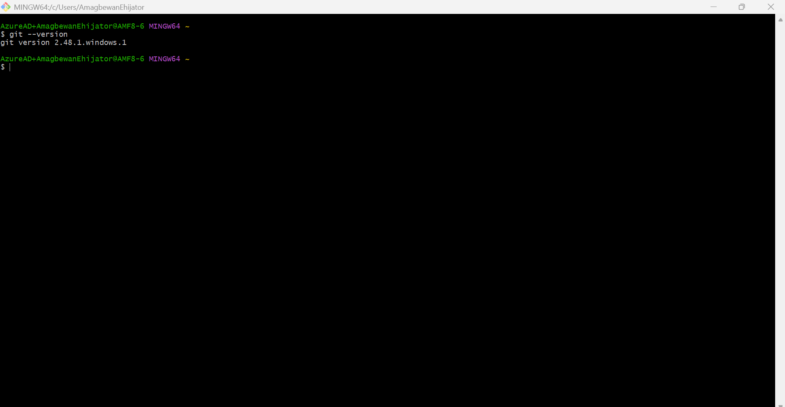
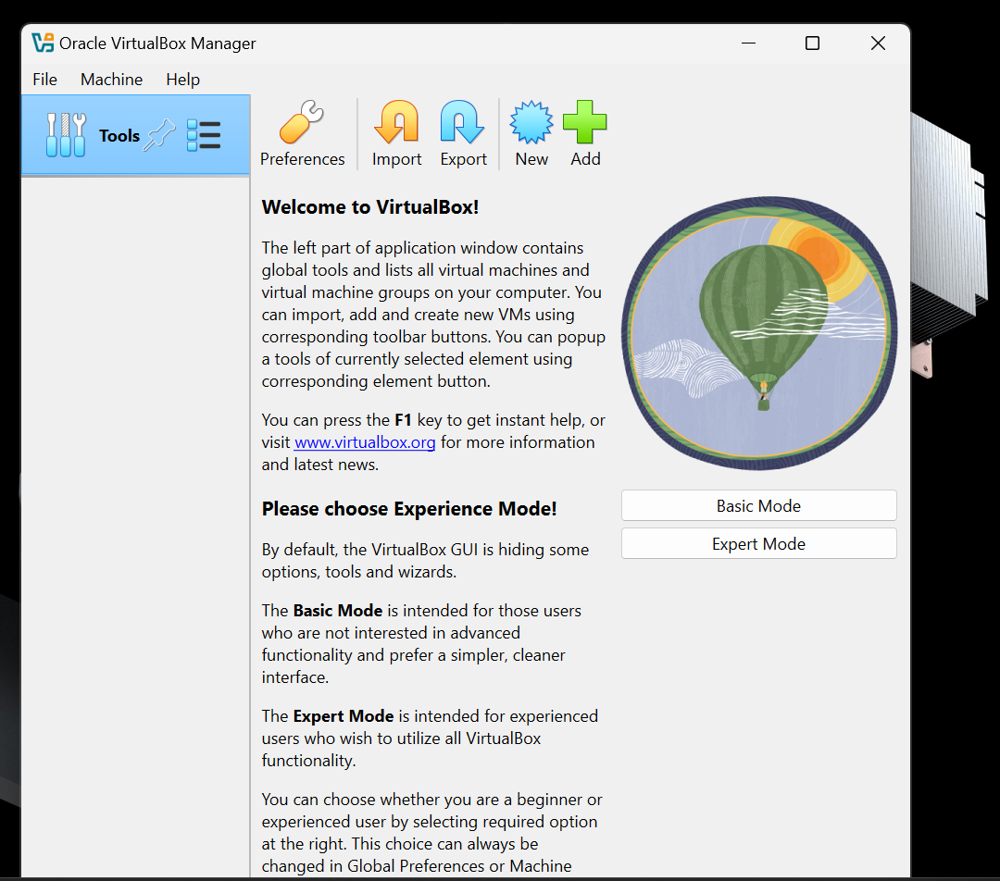
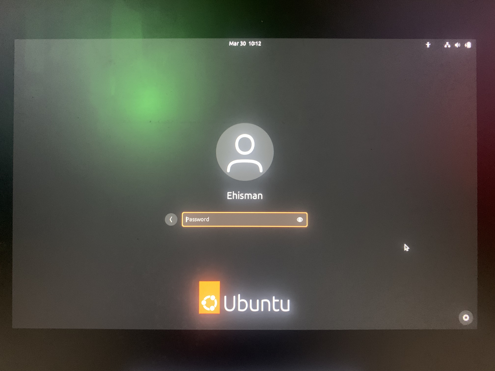
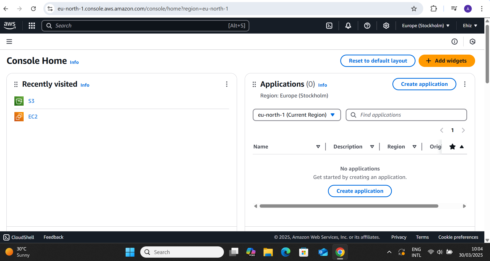
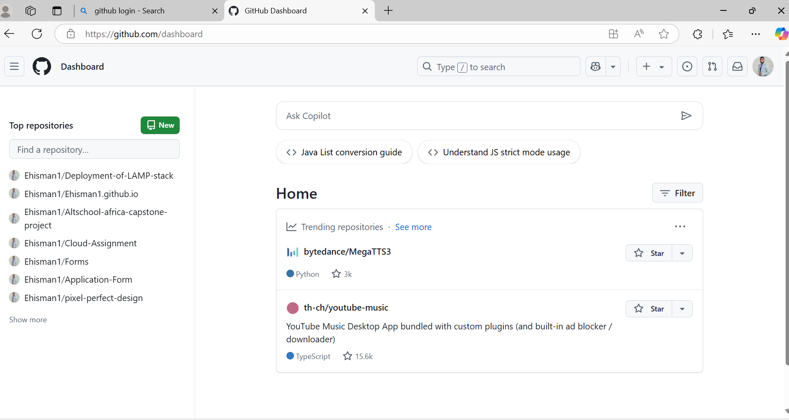

### MINI PROJECT

### The aim of this mini project is to allow learners install and prepare their work tools and tech environment. 

### Tools to be installed are; 

1. VS Code Editor.
1. Git.
1. VM Ware.
1. Ubuntu.
1. Creation of AWS account.
1. Creation of Github account.

#### **To Install VS Code:** 

* *Go to VS code Website*
* *Click download*
* *Run the .exe file to Install*
* *Launch VS Code on the system*

#### **To install GIT:**

* *Go to git website*
* *Click download git*
* *Install git bash by running the downloaded file*
* *Launch git on your computer from the start menu*

#### **To install VM WARE:**

* *Go to git website*
* *Click download VM ware latest version*
* *Install VM ware on your local machine by running the downloaded file*
* *Launch VM ware on your computer from the start menu*

#### **To install UBUNTU:**

* *Go to ubuntu website*
* *Click download ubuntu latest version*
* *Launch VM ware  virtual box on your local machine*
* *Click add to start Installation of UBUNTU iso file on your local machine*

#### **To create an AWS account:**

* *Go to AWS website*
* *Click on signup*
* *Enter your email*
* *Enter preferred username and password*
* *Select a free tier account*
* *Login after clicking on the activation link sent to your mail*

#### **To create a GITHUB account:**

* *Go to github website*
* *Click on signup*
* *Enter your email*
* *Enter preferred username and password*
* *Login after clicking on the activation link sent to your mail*

